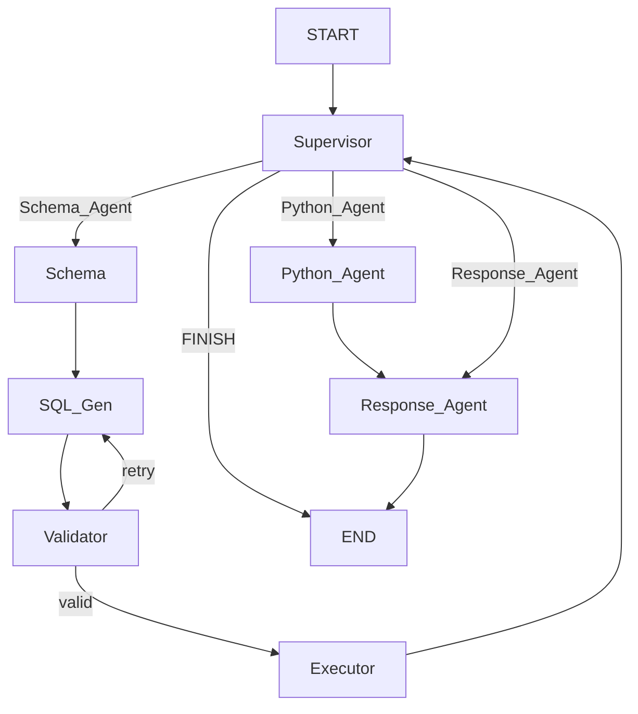

# Multi-Agent SQL Assistant (LangGraph)

This project is a production-quality, fully local Multi-Agent SQL Assistant built from scratch using **LangGraph**, **LangChain**, **Ollama**, and **Streamlit**. 

It is capable of understanding natural language, generating secure SQLite queries, validating them, executing them, generating Python visualizations (`matplotlib`), and returning professional natural language responses.

## Architecture

The project relies on a strict, manually wired LangGraph `StateGraph` rather than prebuilt tools. This provides 100% control over the execution flow.



## Folder Structure
```text
sql_multi_agent/
├── app.py                  # Entry point for Streamlit dashboard
├── graph.py                # Defines the LangGraph Architecture (Nodes, Edges)
├── state.py                # Defines the shared memory TypedDict
├── requirements.txt        # Python dependencies
├── agents/                 # The Nodes (Workers)
│   ├── supervisor.py       # Brain: Decides where to route next
│   ├── schema_agent.py     # Fetches DB structure
│   ├── sql_generator.py    # Translates NLP to SQL
│   ├── validator.py        # Validates and sanitizes SQL
│   ├── executor.py         # Runs SQL against SQLite
│   ├── python_agent.py     # Generates Matplotlib charts
│   └── response_agent.py   # Formats results into English
├── database/               # The Dummy Company Database
│   ├── company.db
│   └── init_db.py          # Script to generate tables and sample data
├── prompts/                # Strict personas for the LLM
│   ├── supervisor.txt
│   ├── sql.txt
│   ├── validator.txt
│   ├── python.txt
│   └── response.txt
├── tools/                  # Utility Functions
│   ├── sql_tools.py        # Database wrappers
│   └── python_tool.py      # Code execution wrapper
└── ui/
    └── streamlit_app.py    # The Streamlit UI
```

## Core LangGraph Concepts

### State Management (`state.py`)
LangGraph passes a centralized dictionary (`AgentState`) between nodes. When a node finishes, it returns a dictionary that updates this state. We use `Annotated[list[BaseMessage], add_messages]` to ensure conversation history is appended rather than overwritten.

### Conditional Edges (Routing)
Instead of static paths, we use `workflow.add_conditional_edges()`. The Supervisor node outputs a string (e.g., `"Schema_Agent"`). LangGraph evaluates this string and routes the graph dynamically.

### The Retry Loop
If the `Validator` node detects dangerous SQL (like `DROP TABLE`), it appends an error to `state["sql_errors"]`. The conditional edge checks if this list is not empty and routes *backwards* to the `SQL_Generator`. The Generator's prompt injects the error so it can learn from its mistake and try again.

### Checkpoint Memory
By compiling the graph with `MemorySaver()` and passing a `thread_id` config, LangGraph remembers the state across multiple user interactions, enabling true conversation history.

## Installation & Running Locally

1. **Install Ollama** and pull the required model:
   ```bash
   ollama pull qwen3.5:2b
   ```

2. **Set up the Python Environment**:
   ```bash
   python3 -m venv venv
   source venv/bin/activate
   pip install -r requirements.txt
   ```

3. **Initialize the Database**:
   ```bash
   python database/init_db.py
   ```

4. **Run the Dashboard**:
   ```bash
   python app.py
   ```
